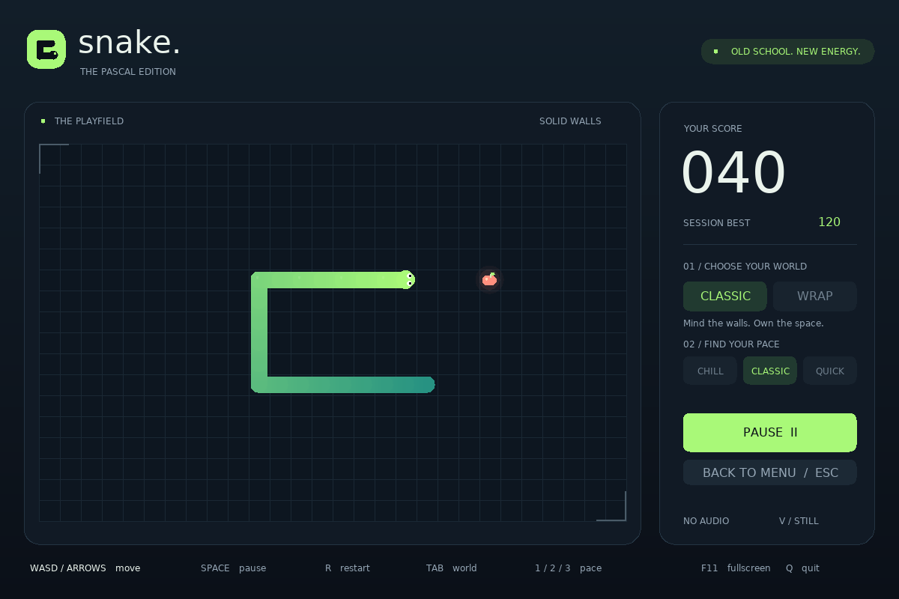

# Snake. — The Pascal Edition

A college programming project, brought back for one more bite.

This started as my university Snake exercise. Years later, I gave a frontier AI
a simple prompt to see how far it could take that old project while keeping
**Pascal as the foundation**. The experiment grew into the modernization here:
a native desktop game with smooth motion, procedural graphics and sound, plus
a lightweight terminal edition. The point is to explore what today's tools can
do with an old idea—not to claim a benchmark win or pretend the result needed
no follow-up, testing or review.



*An actual SDL renderer capture of a staged gameplay fixture. All game code,
including the interface and sound synthesis, is Pascal.*

## Play the desktop edition

You need Free Pascal 3.2.2+, SDL2 2.0.18+, SDL2_ttf and a TrueType font.
On macOS with Homebrew:

```sh
brew install fpc sdl2 sdl2_ttf
make local-build
./build/SnakeGame
```

On Debian/Ubuntu:

```sh
sudo apt-get install fp-compiler make gcc libc6-dev libsdl2-2.0-0 libsdl2-ttf-2.0-0 fonts-dejavu-core
make local-build
./build/SnakeGame
```

Choose **Classic** for solid walls or **Wrap** to cross an edge and appear on
the other side. Self-collisions still end the run. Pick Chill, Classic or Quick
and press Enter. Every apple earns 10 points and five new segments, grown one
step at a time. Fill the board to win.

| Control | Action |
|---|---|
| WASD / arrow keys | Steer |
| Enter | Start, retry, or toggle pause during a run |
| Space / P | Pause or resume; Space also starts |
| R | Restart with the same seed, world and pace |
| Esc | Return to the menu; quit from the menu |
| Tab | Switch worlds in the menu |
| 1 / 2 / 3 | Select pace in the menu |
| M | Mute or unmute |
| V | Toggle reduced motion |
| F11 | Toggle fullscreen |
| Q | Quit |

The sidebar also supports a mouse. Losing window focus pauses the game.
Resizing preserves the board's aspect ratio. Reduced motion turns off movement
interpolation, particles, food pulses, impact flashes and panel transitions.

Records are **session-only and separate for each world/pace combination**.
Nothing is written to your personal folders. No account, server or network is
needed while playing. Optional sound failure does not prevent a run.

```sh
./build/SnakeGame --seed 42
./build/SnakeGame --no-audio --reduced-motion
./build/SnakeGame --help
```

The seed is an unsigned decimal integer from 0 to 4294967295.
Set `SNAKE_FONT` to a font path if the system has neither DejaVu Sans nor Arial.
The renderer uses drawn icons instead of platform-dependent emoji fonts.

## Play in a terminal

Docker is sufficient; no host Pascal or SDL installation is required:

```sh
make test
make play
```

Use an ANSI terminal at least **70 × 24**. The terminal edition uses the classic
30 × 14 board: `@@` is the head, `oo` the body and `<>` an apple. Press
1/2/3 to choose pace, Enter to start, WASD/arrows to steer, P/Space to pause,
R to return to the ready screen, and Q/Esc/Ctrl-C to quit. Resizing pauses play.

```sh
docker compose run --rm --build snake_game
# Or, after a native build:
./build/SnakeTerminal --seed 42
```

Docker launches the terminal edition, not a desktop window. Run the native
`SnakeGame` executable for graphics.

## Build and verify

| Command | Purpose |
|---|---|
| `make test` | Pinned Docker build, Pascal rules, PTY and SDL integration tests |
| `make image` | Build the non-root terminal image |
| `make smoke` | Exercise the packaged image through a host PTY |
| `make local-build local-test local-smoke` | Run both editions' checks with installed dependencies |
| `make local-play` | Build and open the desktop game |
| `make preview` | Regenerate the README capture; requires Docker and ImageMagick |

The Docker toolchain fixes the Debian base digest, APT snapshot and compiler.
Tests check collision, wraparound, growth, food placement, full-board victory,
seeded determinism, controls, focus loss, rendering and resource cleanup.
Python is test infrastructure, not part of gameplay.

Linux ARM64 and native macOS ARM64 have been exercised locally. The CI matrix
also targets Linux AMD64. See [validation](docs/Validation.md) for the exact
evidence and remaining platform limits. Windows is not currently supported by
the supplied Unix terminal target and library loader.

## Try this with your own college project

Copy the [reusable modernization prompt](docs/Try%20your%20Project.md), attach or
point your AI at your project, and keep the original language constraint.
Judge the result by running it, inspecting the implementation and checking
what was actually tested—not by the confidence of the answer.

## Explore the implementation

- [The original exercise and its limitations](docs/Baseline.md)
- [Architecture, rules and SDL integration](docs/Architecture.md)
- [Implementation recipe](plans/2026-09-13-implementation.md)
- [Validation evidence](docs/Validation.md)
- [Changelog](CHANGELOG.md)

Start with [snake_engine.pas](src/snake_engine.pas), then its
[Pascal tests](tests/test_snake_engine.pas). The snake is still an array of
records. [snake_desktop.pas](src/snake_desktop.pas) owns the desktop experience;
[snake_terminal.pas](src/snake_terminal.pas) owns the CRT edition.

The original remains in Git at `15477b37f4d26bc9571228086d40884991633efb`.
No repository license has been chosen on the author's behalf. SDL, Free Pascal
and system fonts retain their own licenses; no font or third-party source
package is vendored here.
